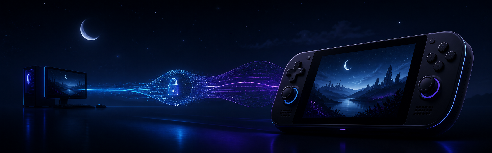
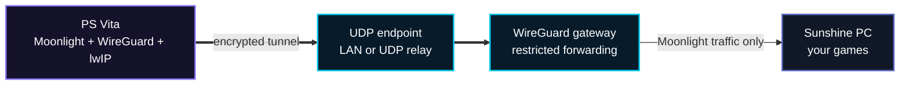

<div align="center">



# Moonlight Tailscale for PS Vita

### Stream your PC through a private, user-space WireGuard tunnel.

[](https://github.com/polarco/moonlight-tailscale-vita/releases/latest)
[](https://github.com/polarco/moonlight-tailscale-vita/actions/workflows/host-tests.yml)
[](LICENSE)

[Download VPK](https://github.com/polarco/moonlight-tailscale-vita/releases/latest) ·
[Build from source](#build-from-source) ·
[Current status](#current-state-2026-08-26) ·
[Roadmap](#roadmap-to-019) ·
[Report a bug](https://github.com/polarco/moonlight-tailscale-vita/issues/new?template=bug_report.yml) ·
[Contribute](CONTRIBUTING.md)

</div>

> [!NOTE]
> Release **0.1.8** has been tested on a PCH-1001 with video, audio, controls,
> and keyboard input crossing the WireGuard gateway.

Moonlight Tailscale is an experimental PS Vita homebrew client that gives Vita
Moonlight its own private network path. WireGuard and lwIP run entirely inside
the application: no kernel plugin and no system-wide tunnel are required.

## Current state (2026-08-26)

> [!WARNING]
> **LAN streaming is validated. Remote streaming over a high-latency UDP relay
> is not validated yet.** Release 0.1.8 should not be presented as a proven
> play-anywhere solution.

| Area | Evidence available today | State |
|---|---|:---:|
| PCH-1001 on the same LAN as the gateway | Video, audio, controller, keyboard, pause/resume, and clean quit | ✅ Validated |
| User-space WireGuard/lwIP data path | Noise IK, bidirectional TCP/UDP, keepalive, replay handling, and host tests | ✅ Validated |
| External UDP relay to the gateway | Relay delivery, WireGuard handshake, bidirectional bytes, HTTP, and early RTSP exchanges | ✅ Validated |
| Remote RTSP launch | Previous run reached Sunshine, then failed with error 104 near the former 10-second launch timeout | ⚠️ Blocked in last run |
| Sunshine 30-second launch timeout | Sunshine has logged the effective value `ping_timeout = 30000` | ✅ Applied |
| Remote first frame and two-minute stream | No Vita attempt has been completed since the timeout change | ⏳ Pending |
| Remote stability across rekeys | Requires three cold starts and a five-minute session after the smoke test passes | ⏳ Pending |

### What the last remote test proved

The external path was not failing at WireGuard or basic reachability. It
carried encrypted traffic in both directions and progressed through Moonlight's
HTTP bootstrap and the first RTSP transactions. The fourth RTSP connection
arrived about 9.34 seconds after the first SYN; Sunshine closed the pending
launch session near its former 10-second limit, and the Vita reported error
104.

Sunshine now confirms a 30-second `ping_timeout`. That changes the hypothesis,
not the result: a new physical Vita smoke test is still required before remote
video, audio, or input can be claimed as working.

## At a glance

| Private by design | Built for streaming | Reproducible |
|:---:|:---:|:---:|
| Static WireGuard identity stays on the Vita | TCP and UDP GameStream traffic cross the same tunnel | Upstream revisions and patches are pinned |
| Gateway exposes only the ports you choose | 8,192-packet replay window tolerates reordered traffic | Host cryptography and lwIP tests run in CI |
| No key, peer file, or pairing data ships in the VPK | Video, audio, controller, and keyboard tested | VPK packaging is checked for secrets |

## How it fits together



The tunnel uses `10.77.0.2/24` on the Vita with an MTU of 1280. A typical
gateway uses `10.77.0.1/24` and forwards only the Sunshine ports required by
your setup.

> [!IMPORTANT]
> Despite the project name, this is **not a complete Tailscale client**. It
> does not implement the Tailscale control plane, device registration, DERP,
> MagicDNS, or automatic key rotation. Version 0.1.8 uses one static
> WireGuard peer configured locally on the console.

## What is included

- Vita Moonlight 0.13.2 with a user-space WireGuard/lwIP path.
- Persistent WireGuard identity generated and stored on the console.
- Static IPv4 peer configuration loaded from `ux0:data/TailscaleVita/`.
- Socket adaptation for Moonlight's HTTP, RTSP, video, audio, and input flows.
- An 8,192-packet replay window for traffic reordered under streaming load.
- Pinned Vita Moonlight, wireguard-lwip, and lwIP revisions.
- Host-side Noise IK, encrypted packet, keepalive, and lwIP self-tests.
- A reproducible VitaSDK build and VPK safety verification.

## Install the current release

1. Download `Moonlight-Tailscale-Vita-v0.1.8.vpk` from the
   [latest release](https://github.com/polarco/moonlight-tailscale-vita/releases/latest).
2. Transfer and install the VPK with VitaShell.
3. Create the private identity and peer configuration described below.
4. Configure your gateway to terminate WireGuard and forward only the required
   Sunshine traffic.
5. Pair Moonlight with Sunshine and start with a conservative bitrate.

The app uses Title ID `TSVITAML1`, so it can coexist with the official Vita
Moonlight installation.

### Console configuration

The application expects these files:

```text
ux0:data/TailscaleVita/wg-private.key
ux0:data/TailscaleVita/wg-peer.conf
```

`wg-private.key` is a raw 32-byte private key. **Never share or commit it.**

The peer file contains the gateway public key and a numeric IPv4 endpoint:

```ini
peer_public_key=BASE64_GATEWAY_PUBLIC_KEY
endpoint_ip=203.0.113.10
endpoint_port=51820
```

The address above is reserved for documentation. Replace it with your own LAN
or relay endpoint; do not paste real keys or endpoints into public issues.

## Build from source

### Requirements

- Git, CMake, a C11 compiler, and standard Unix build tools;
- [VitaSDK](https://vitasdk.org/) with `VITASDK` exported;
- Vita Moonlight build dependencies, including `libvita2d` and zstd.

```sh
git clone https://github.com/polarco/moonlight-tailscale-vita.git
cd moonlight-tailscale-vita

export VITASDK=/path/to/vitasdk
export PATH="$VITASDK/bin:$PATH"

./scripts/build-moonlight.sh
```

The build script fetches and verifies the pinned dependencies, applies the
repository patches, creates the VPK, and checks that no identity or peer
configuration entered the package.

Run the portable host test suite without VitaSDK:

```sh
./scripts/test-host.sh
```

## Project layout

```text
moonlight/   Moonlight tunnel and socket adapter
src/         WireGuard probes and portable helpers
patches/     Reproducible upstream changes
scripts/     Dependency, test, and Vita build entry points
tests/       Host interoperability and VPK checks
deploy/      Optional gateway service template
tools/       Development-side echo responder
```

## Capability matrix

| Capability | Status |
|---|:---:|
| WireGuard Noise IK handshake | ✅ |
| Encrypted IPv4/UDP over lwIP | ✅ |
| Moonlight pairing and app listing | ✅ |
| Video, audio, controls, and keyboard | ✅ |
| Physical PCH-1001 LAN validation | ✅ |
| High-latency remote paths | 🧪 Experimental |
| Tailscale control plane / DERP | ❌ Out of scope |

### High-latency links

Sunshine's default `ping_timeout` is 10 seconds. A remote path near one second
of round-trip latency may not finish Moonlight's sequential RTSP setup before
the pending launch session expires. On a trusted personal host, setting
`ping_timeout = 30000` can provide additional setup time. Treat this as an
experimental compatibility adjustment, not a universal recommendation.

The reference host has confirmed that value in its effective configuration,
but the follow-up physical Vita test is still pending.

## Roadmap to 0.1.9

Development is evidence-driven: the next runtime change will address the first
failure reproduced after the 30-second Sunshine timeout, rather than assuming
the remaining problem is in the Vita client.

### Gate 1 — remote smoke test

- [x] Prove external UDP relay delivery to the WireGuard gateway.
- [x] Prove WireGuard handshake and bidirectional traffic from the Vita.
- [x] Reach Sunshine HTTP and RTSP services through the tunnel.
- [x] Confirm Sunshine loaded `ping_timeout = 30000`.
- [ ] Complete a cold start, display the first frame, and verify video, audio,
  and one controller command.
- [ ] Maintain the stream for two minutes, pause/resume once, and quit cleanly.

### Gate 2 — stability and recovery

- [ ] Pass three consecutive cold starts.
- [ ] Stream for at least five minutes, crossing the 100- and 200-second
  WireGuard rekeys without a visible interruption.
- [ ] Exercise three pause/resume cycles.
- [ ] Characterize behavior after a ten-second hotspot interruption.
- [ ] Compare the same 960×544, 30 FPS, 3 Mb/s profile on LAN and remotely.

### Candidate 0.1.9 engineering work

- Session summary with TX/RX bytes, handshakes, rekeys, and rejection reasons.
- Peer/configuration parser tests for valid, missing, truncated, and malformed
  input.
- Socket-shim harness for non-blocking connect, EOF, `poll`/`select`, `fcntl`,
  and UDP timeout fallback behavior.
- Loss, duplication, reordering, and burst tests around the 8,192-packet replay
  window.
- Longer host-side keepalive/rekey coverage and a separate reproducible VitaSDK
  workflow.

The complete gates, release rules, and decision tree are maintained in
[ROADMAP.md](ROADMAP.md).

### Explicitly out of scope for 0.1.9

- Tailscale login, control-plane registration, DERP, MagicDNS, and tailnet ACL
  management.
- Automatic relay provisioning or router/firewall configuration.
- Shipping private keys, peer files, endpoints, or Sunshine credentials.
- Claiming general Internet compatibility before the physical gates above
  pass.

## Contributing and security

Issues and focused pull requests are welcome. Start with
[CONTRIBUTING.md](CONTRIBUTING.md), run `./scripts/test-host.sh`, and include
physical Vita results when changing the runtime path.

Do not attach private keys, pairing certificates, personal endpoints, console
dumps, or unsanitized logs to an issue. Use GitHub's private vulnerability
reporting flow described in [SECURITY.md](SECURITY.md) for security problems.

## License and acknowledgements

This project is licensed under the [GNU GPL v3](LICENSE), matching Vita
Moonlight and moonlight-common-c. Third-party licenses and pinned upstream
revisions are documented in [THIRD_PARTY_NOTICES.md](THIRD_PARTY_NOTICES.md).

This independent project is not affiliated with or endorsed by Tailscale Inc.,
Moonlight, Sunshine, Sony Interactive Entertainment, or their contributors.
All product names and trademarks belong to their respective owners.

<div align="center">

Made for the PS Vita homebrew community — carefully, reproducibly, and in the open.

</div>
